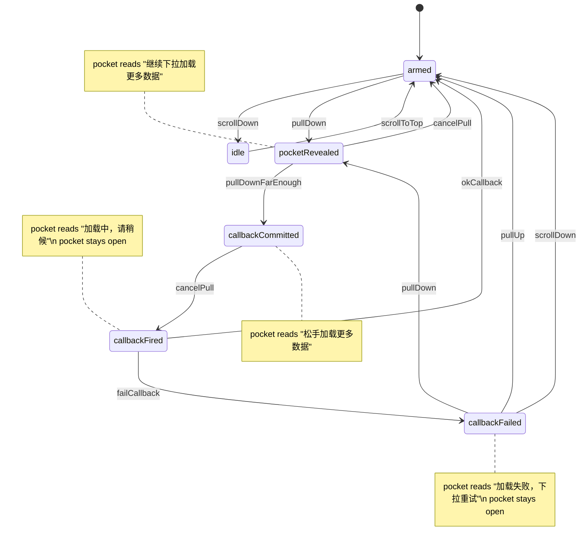

# pull-to-refresh behaviour

# 下拉刷新效果

## 状态机



### params for transition event listeners

```typescript
type Event<T> = {
    type: string,
    data: T
}

type TransitionEvent = Event<{
    leaving: any,
    entering: any,
    event: any,
    more: undefined | any[]
}>
```

## 警惕

用 reduce 一定要指定初始值，否则如果数组只有一个元素的话，reducer
根本不会执行。数组没有元素的话，reducer 不执行是符合预期的。
